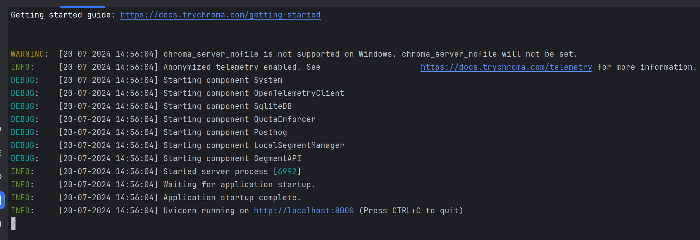
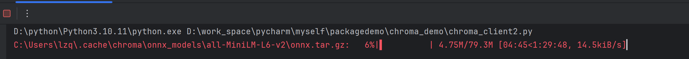

# chromadb 官方教程 

https://docs.trychroma.com/ 

| 环境        | 版本    |
|-----------|-------|
| python    | 3.10  |
| chromadb  | 0.5.4 |

## 快速启动

### 启动chromadb
```shell
chroma run --path ./db_data
```


### 访问chromadb
```python
import chromadb
chroma_client = chromadb.Client()

# switch `create_collection` to `get_or_create_collection` to avoid creating a new collection every time
collection = chroma_client.get_or_create_collection(name="my_collection")

# switch `add` to `upsert` to avoid adding the same documents every time
collection.upsert(
    documents=[
        "This is a document about pineapple",
        "This is a document about oranges"
    ],
    ids=["id1", "id2"]
)

results = collection.query(
    query_texts=["This is a query document about florida"], # Chroma will embed this for you
    n_results=2 # how many results to return
)

print(results)
```
访问需要下载 onnx.tar.gz
运行以上代码,会自动下载onnx.tar.gz


速度太慢,选择离线下载:

https://www.modelscope.cn/models/wengad/all-MiniLM-L6-v2/files

离线下载后,运行以下代码: 详见chroma_client1.py
```python
import chromadb
chroma_client = chromadb.Client()

# 增加onnx.tar.gz文件路径
file_path = r"C:\Users\lzq\.cache\chroma\onnx_models\all-MiniLM-L6-v2\onnx.tar.gz"

# switch `create_collection` to `get_or_create_collection` to avoid creating a new collection every time
collection = chroma_client.get_or_create_collection(name="my_collection")

# switch `add` to `upsert` to avoid adding the same documents every time
collection.upsert(
    documents=[
        "This is a document about pineapple",
        "This is a document about oranges"
    ],
    ids=["id1", "id2"],
    uris=[file_path, file_path]  # 添加文件路径
)

results = collection.query(
    query_texts=["This is a query document about florida"], # Chroma will embed this for you
    n_results=2 # how many results to return
)

print(results)
```

结果如下
```
{
	'ids': [
		['id2', 'id1']
	],
	'distances': [
		[1.1462137699127197, 1.3015384674072266]
	],
	'metadatas': [
		[None, None]
	],
	'embeddings': None,
	'documents': [
		['This is a document about oranges', 'This is a document about pineapple']
	],
	'uris': None,
	'data': None,
	'included': ['metadatas', 'documents', 'distances']
}
```

## embedding
生成向量

见chrom_embedding.py

结果如下
```
{
	'ids': [
		['id2', 'id1']
	],
	'distances': [
		[1.6917213201522827, 1.8506078720092773]
	],
	'metadatas': [
		[None, None]
	],
	'embeddings': None,
	'documents': [
		['This is a document about oranges', 'This is a document about pineapple']
	],
	'uris': None,
	'data': None,
	'included': ['metadatas', 'documents', 'distances']
}
```

## metadata 元数据
相当个文档打标签,查询的时候,可以指定标签,只返回指定标签的文档
见chrom_metadata.py

查询character = 20 的数据
```
results = collection.query(
    where={"character": "20"}, # 默认是$eq
    query_texts=["This is a query document about florida"], # Chroma will embed this for you
    n_results=2  # how many results to return
)
```
等同于
```
results = collection.query(
    where={
        "character": {
            "$eq": "20"
        }
    },
    query_texts=["This is a query document about florida"], # Chroma will embed this for you
    n_results=2  # how many results to return
)
```
### collection where 比较运算符
```
$eq - equal to (string, int, float) 
$ne - not equal to (string, int, float)
$gt - greater than (int, float)
$gte - greater than or equal to (int, float)
$lt - less than (int, float)
$lte - less than or equal to (int, float)
```

结果如下
```
{
	'ids': [
		['id1']
	],
	'distances': [
		[0.6507691740989685]
	],
	'metadatas': [
		[{
			'character': '20'
		}]
	],
	'embeddings': None,
	'documents': [
		['This is a document about pineapple']
	],
	'uris': None,
	'data': None,
	'included': ['metadatas', 'documents', 'distances']
}
```


### 运算符-补充
#### 多条件 与/或
```
{
    "$and":[
        "character": {
            "$eq": "20"
        },
        "character": {
            "$eq": "21"
        }
   ]
}
```
```
{
    "$or":[
        "character": {
            "$eq": "20"
        },
        "character": {
            "$eq": "21"
        }
   ]
}
```
#### 包含查询 (in/not in)
```
"character": {
    "$in": ["20","21"]
}
```
```
"character": {
    "$nin": ["20","21"]
}
```

## 在线模型 知识库向量搜索
### 安装依赖
```shell
pip install langchain langchain-chroma langchain-openai langchain_community
```

### 直接 通过模型搜索 文档
详见 chroma_model.py
结果如下
```
[
Document(page_content='This is a document about dog'),
Document(page_content='This is a document about fish'),
Document(page_content='This is a document about banana')
]
```

### 本地创建知识库,并通过模型搜索

详见chroma_model_client_server.py

结果如下
```
[
Document(page_content='This is a document about dog'),
Document(page_content='This is a document about fish'),
Document(page_content='This is a document about banana')
]
```

### httpclient创建知识库,并通过模型搜索

详见chroma_model_client_server_http.py

结果如下
```
[
Document(page_content='This is a document about dog'),
Document(page_content='This is a document about fish'),
Document(page_content='This is a document about banana')
]
```